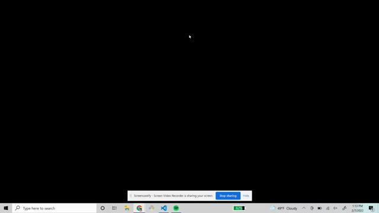

## JS quiz

--[Table of Contents]--

1.[Description](#description)

2.[Install](#install)

3.[Instructions](#instructions)

4.[Credits](#credits)

5.[Questions](#email)

## Description

This is a 4 question quiz  to test your basic knowledge of javascript

## Install

To install, just clone the github repo to your computer.

## Instructions

To use, open the index.html file on your browser and press start. to replay the game refresh your browser window.

## Credits

Marshall Baccari (me)

## License

This project is protected under Mozilla Public License 2.0.

https://choosealicense.com/licenses/mpl-2.0

## Questions

-If you have questions, feel free to email me at marshall.d.baccari@gmail.com

-Check out my github profile at https://github.com/mbaccari

## Video of usage

